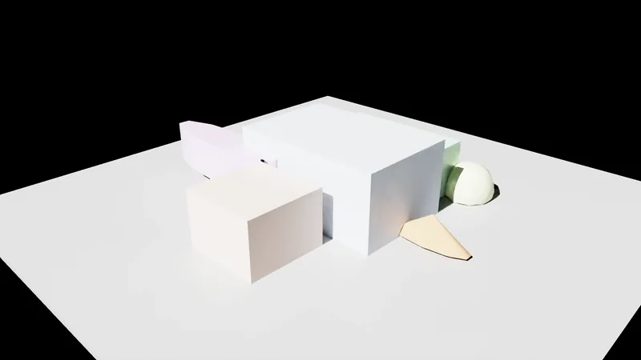

# agenTW∞rld Extensions

A suite of Isaac Sim extensions that provide AI agents with comprehensive world interaction capabilities through unified APIs and MCP integration.

## Overview

agenTW∞rld Extensions enable AI agents to build, view, navigate, and record 3D worlds in Isaac Sim through a consistent set of HTTP APIs and Model Context Protocol (MCP) tools. Each extension provides specialized functionality while maintaining a unified architecture for seamless integration.



*Experience a guided tour through the agenTW∞rld Extensions showcasing camera controls, waypoint navigation, and scene interaction capabilities.*

## Extensions

### 🏗️ WorldBuilder
Create and manipulate 3D scenes programmatically. Add primitives (cubes, spheres, cylinders), place USD assets, organize elements into batches, and manage complex scene hierarchies.

**Key Features:**
- Primitive creation (cubes, spheres, cylinders, cones)
- USD asset placement with transform controls
- Batch operations for complex scene building
- Scene querying and spatial analysis
- Real-time scene validation

### 🎥 WorldViewer  
Control camera positioning and create cinematic movements in Isaac Sim. Navigate through 3D scenes with smooth camera transitions and orbital controls.

**Key Features:**
- Camera positioning and targeting
- Orbital camera controls around objects
- Smooth cinematic movements with easing
- Object framing and automatic positioning
- Camera bounds checking for safety

### 🧭 WorldSurveyor
Mark and organize spatial locations with waypoints and groups. Create persistent spatial references for navigation, annotation, and scene organization.

**Key Features:**
- Waypoint creation at 3D coordinates
- Hierarchical waypoint grouping
- Persistent waypoint storage
- Visual markers with customizable visibility
- Spatial queries and navigation

### 📹 WorldRecorder
Capture screenshots and record videos from Isaac Sim viewports. Generate visual documentation and recordings of 3D scenes and simulations.

**Key Features:**
- Single frame capture with optional depth
- Video recording with hardware acceleration
- Multiple codec support (H.264, etc.)
- Configurable quality and resolution
- Automatic output management

## Quick Start

Get up and running in minutes with the automated installer:

```bash
# Clone the repository
git clone https://github.com/sherndon79/agent-world.git
cd agent-world

# Run the installer (handles everything automatically)
bash scripts/install_agent_world.sh

# Launch Isaac Sim with extensions enabled
bash scripts/launch_agent_world.sh

# Verify everything works
bash scripts/smoke_test.sh
```

That's it! The installer will:
- Download and install Isaac Sim if needed
- Set up all extensions and dependencies
- Configure authentication and MCP servers
- Create launch scripts for easy startup


*Claude Code MCP integration in action - AI agents can seamlessly create scenes, navigate cameras, place waypoints, and interact with 3D worlds through natural language commands.*

## Isaac Sim Integration

Once installed, the agenTW∞rld Extensions integrate seamlessly into Isaac Sim's interface:


*All four agenTW∞rld Extensions available in Isaac Sim's Extensions browser, showing version information and installation status.*


*Extensions docked in Isaac Sim's workspace, providing direct access to controls and real-time status information alongside the 3D viewport.*

## Architecture

- **Unified Configuration** - Centralized settings with environment overrides
- **Consistent APIs** - Standardized HTTP endpoints across all extensions
- **MCP Integration** - Native Model Context Protocol support for AI workflows
- **Thread Safety** - Proper Isaac Sim threading for UI and simulation stability
- **Extensible Design** - Modular architecture for easy customization

## Agent Orchestration

**agenTW∞rld Extensions are designed for AI agent orchestration.** Each extension operates independently with no inter-extension dependencies, allowing AI agents to:

### **Compose Complex Workflows**
```
AI Agent: "Create a city scene, position camera for aerial view, mark key locations, then record a flythrough"
↓
WorldBuilder → WorldViewer → WorldSurveyor → WorldRecorder
```

### **Independent Operation**
- **No coupling**: Extensions don't depend on each other
- **À la carte usage**: Install and run only the extensions you need
- **Partial deployments**: Use WorldBuilder alone, or just WorldViewer + WorldRecorder
- **Parallel execution**: AI agents can use multiple extensions simultaneously  
- **Fault isolation**: One extension failing doesn't break others
- **Flexible orchestration**: AI decides the sequence and combination

### **AI-Driven Coordination**
Rather than hard-coded workflows, **AI agents orchestrate extensions dynamically** based on user needs:
- Analyze requirements and determine which extensions to use
- Sequence operations across multiple extensions
- Handle errors and retry strategies
- Adapt workflows based on intermediate results

This architecture enables emergent, intelligent workflows that weren't explicitly programmed.

## Documentation

- [Installation Guide](docs/installation.md)
- [Configuration Reference](docs/configuration.md)
- [MCP Integration Guide](docs/mcp-integration.md)
- [Screenshot MCP Server](docs/screenshot-mcp.md)
- [Extension Guides](docs/extensions/)
  - [WorldBuilder](docs/extensions/worldbuilder.md)
  - [WorldViewer](docs/extensions/worldviewer.md)
  - [WorldSurveyor](docs/extensions/worldsurveyor.md)
  - [WorldRecorder](docs/extensions/worldrecorder.md)

## Default Ports

- **WorldBuilder**: `8899` - Scene creation and manipulation
- **WorldViewer**: `8900` - Camera control and cinematics
- **WorldSurveyor**: `8891` - Waypoints and spatial marking
- **WorldRecorder**: `8892` - Screenshots and video recording

## Ports & Environment Variables

- API base URL overrides (MCP/local tools):
  - `WORLDBUILDER_API_URL` (default `http://localhost:8899`)
  - `WORLDVIEWER_API_URL` (default `http://localhost:8900`)
  - `WORLDSURVEYOR_API_URL` (default `http://localhost:8891`)
  - `WORLDRECORDER_API_URL` (default `http://localhost:8892`)

- Authentication (global):
  - `AGENT_EXT_AUTH_ENABLED` = `true|false` (global on/off; default on)
  - `AGENT_EXT_AUTH_TOKEN` (Bearer token; installer writes to `.env`)
  - `AGENT_EXT_HMAC_SECRET` (HMAC secret; installer writes to `.env`)
  - Per‑service overrides (optional):
    - `AGENT_WORLDBUILDER_AUTH_TOKEN`, `AGENT_WORLDBUILDER_HMAC_SECRET`
    - `AGENT_WORLDVIEWER_AUTH_TOKEN`, `AGENT_WORLDVIEWER_HMAC_SECRET`
    - `AGENT_WORLDSURVEYOR_AUTH_TOKEN`, `AGENT_WORLDSURVEYOR_HMAC_SECRET`
    - `AGENT_WORLDRECORDER_AUTH_TOKEN`, `AGENT_WORLDRECORDER_HMAC_SECRET`

- Isaac settings (applied via launcher and UI):
  - `/exts/omni.agent.worldbuilder/auth_enabled=true`
  - `/exts/omni.agent.worldviewer/auth_enabled=true`
  - `/exts/omni.agent.worldsurveyor/auth_enabled=true`
  - `/exts/omni.agent.worldrecorder/auth_enabled=true`

Config precedence (effective):
- Environment variables → Isaac settings → JSON files → defaults
- Cross‑cutting HTTP behavior (CORS/JSON formatting): `agent-world-http.json`

## Requirements

- **Isaac Sim 5.0.0** (recommended - developed and tested against this version)
  - [Linux x86_64 Download](https://download.isaacsim.omniverse.nvidia.com/isaac-sim-standalone-5.0.0-linux-x86_64.zip)
  - [Windows x86_64 Download](https://download.isaacsim.omniverse.nvidia.com/isaac-sim-standalone-5.0.0-windows-x86_64.zip)
  - Note: Newer versions may work but are not officially tested
- Python 3.8+ (provided by Isaac Sim)
- NVIDIA GPU with graphics drivers
- Sufficient disk space for recordings (WorldRecorder)

## Support

Each extension includes comprehensive health endpoints, metrics collection, and debug capabilities for troubleshooting and monitoring.

## License

This project is licensed under the MIT License - see the [LICENSE](LICENSE) file for details.
