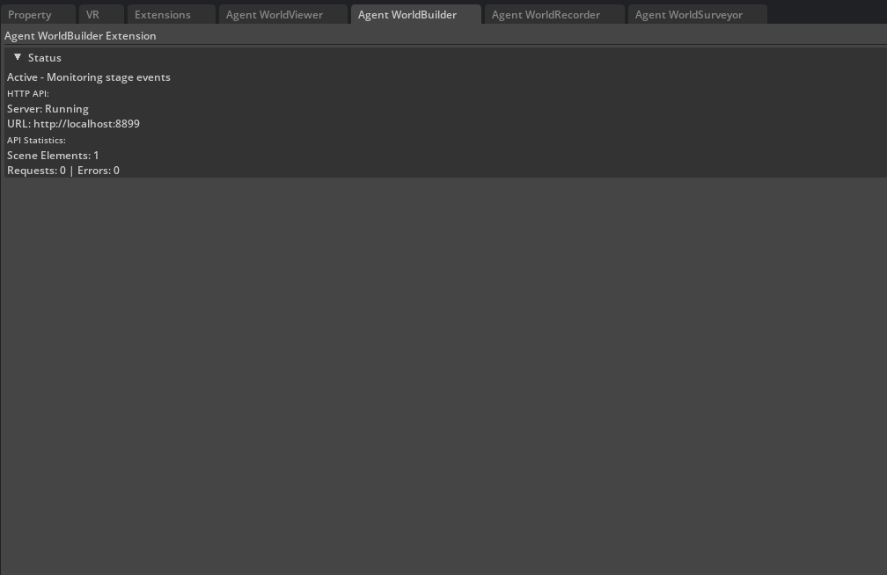

# WorldBuilder Extension

Build and manipulate 3D scenes programmatically in Isaac Sim. WorldBuilder provides comprehensive scene creation capabilities for AI agents, from simple primitive placement to complex hierarchical scene construction.


*WorldBuilder extension interface in Isaac Sim showing scene creation tools and extension controls.*

## For New Users

**WorldBuilder lets AI agents build 3D scenes programmatically.** Instead of manually placing objects in Isaac Sim, you can:

- **Ask Claude Code**: "Create a simple city scene with buildings and roads"
- **Build procedurally**: Generate complex scenes through natural language commands
- **Use MCP tools**: All functionality is accessible through Claude Code's MCP integration

**You don't need to use the HTTP API directly** - the MCP integration handles all the technical details automatically.

## Features

### Primitive Creation
- **Basic Shapes**: Cubes, spheres, cylinders, cones
- **Positioning**: Precise 3D coordinate placement
- **Styling**: Color, scale, and material properties
- **Naming**: Unique identifiers for scene organization

### USD Asset Integration
- **Asset Placement**: Reference external USD files
- **Transform Control**: Position, rotation, and scale
- **Scene Hierarchy**: Organized prim paths and structure

### Batch Operations
- **Group Creation**: Multiple elements as cohesive units
- **Hierarchical Organization**: Parent-child relationships
- **Bulk Operations**: Efficient multi-element creation

### Scene Management
- **Query System**: Find objects by type, location, or properties
- **Spatial Analysis**: Bounding boxes, ground detection
- **Scene Validation**: Real-time integrity checking

## API Endpoints

### Create Elements

**POST** `/add_element`
```json
{
  "element_type": "cube",
  "name": "my_cube",
  "position": [0, 0, 1],
  "scale": [1, 1, 1],
  "color": [0.8, 0.2, 0.2]
}
```

**POST** `/create_batch`
```json
{
  "batch_name": "furniture_set",
  "elements": [
    {
      "element_type": "cube",
      "name": "table",
      "position": [0, 0, 0.5],
      "scale": [2, 1, 0.1]
    },
    {
      "element_type": "cube", 
      "name": "chair",
      "position": [1, 0, 0.25],
      "scale": [0.5, 0.5, 0.5]
    }
  ]
}
```

### Asset Placement

**POST** `/place_asset`
```json
{
  "name": "building",
  "asset_path": "/path/to/building.usd",
  "position": [10, 0, 0],
  "rotation": [0, 45, 0],
  "scale": [1, 1, 1]
}
```

### Scene Queries

**GET** `/get_scene` - Retrieve complete scene structure
**GET** `/list_elements` - Get flat list of all elements
**POST** `/query/objects_by_type` - Find objects by semantic type
**POST** `/query/objects_in_bounds` - Spatial bounding box queries
**POST** `/query/objects_near_point` - Proximity-based searches

### Scene Management

**POST** `/remove_element` - Remove specific elements
**POST** `/clear_path` - Clear specific USD paths from scene
**POST** `/transform_asset` - Modify existing object transforms

### Utilities

**GET** `/health` - Extension health status
**GET** `/metrics` - Performance and usage metrics
**GET** `/metrics.prom` - Prometheus-format metrics for monitoring systems
**GET** `/openapi.json` - Complete API specification

## Configuration

### Basic Settings
```json
{
  "server_port": 8899,
  "debug_mode": false,
  "max_scene_elements": 1000,
  "enable_batch_operations": true
}
```

### Performance Tuning
```json
{
  "max_batch_size": 100,
  "scene_update_interval": 0.1,
  "batch_processing_delay": 0.05,
  "asset_loading_timeout": 30.0
}
```

### Validation & Limits
```json
{
  "max_element_name_length": 100,
  "max_asset_file_size": 104857600,
  "world_bounds_min": [-100, -100, -100],
  "world_bounds_max": [100, 100, 100]
}
```

## Usage Examples

### Simple Scene Creation
```python
import requests

# Create a ground plane
requests.post('http://localhost:8899/add_element', json={
    'element_type': 'cube',
    'name': 'ground',
    'position': [0, 0, -0.5],
    'scale': [20, 20, 1],
    'color': [0.5, 0.5, 0.5]
})

# Add some objects
requests.post('http://localhost:8899/add_element', json={
    'element_type': 'sphere',
    'name': 'ball',
    'position': [2, 0, 1],
    'color': [1, 0, 0]
})
```

### Batch Scene Construction
```python
# Create a complete room setup
room_batch = {
    'batch_name': 'living_room',
    'elements': [
        {'element_type': 'cube', 'name': 'floor', 'position': [0, 0, -0.1], 'scale': [10, 10, 0.2]},
        {'element_type': 'cube', 'name': 'sofa', 'position': [0, -3, 0.5], 'scale': [3, 1, 1]},
        {'element_type': 'cube', 'name': 'coffee_table', 'position': [0, -1, 0.3], 'scale': [1.5, 0.8, 0.1]},
        {'element_type': 'cylinder', 'name': 'lamp', 'position': [2, -1, 1], 'scale': [0.2, 0.2, 2]}
    ]
}

response = requests.post('http://localhost:8899/create_batch', json=room_batch)
```

### Scene Analysis
```python
# Find all furniture in the scene
furniture = requests.post('http://localhost:8899/query_objects_by_type', 
                         json={'type': 'furniture'})

# Get objects within a specific area  
area_objects = requests.post('http://localhost:8899/query_objects_in_bounds',
                            json={'min': [-5, -5, 0], 'max': [5, 5, 3]})

# Find objects near a point
nearby = requests.post('http://localhost:8899/query_objects_near_point',
                      json={'point': [0, 0, 1], 'radius': 2})
```

## MCP Integration

WorldBuilder provides comprehensive MCP tools for AI agents:

- `worldbuilder_add_element` - Create primitives
- `worldbuilder_create_batch` - Batch creation
- `worldbuilder_place_asset` - USD asset placement
- `worldbuilder_query_objects_*` - Scene analysis tools
- `worldbuilder_scene_status` - Health monitoring

## Error Handling

The extension provides detailed error responses with context:

```json
{
  "success": false,
  "error": "Element name 'cube1' already exists",
  "code": "DUPLICATE_NAME",
  "suggestions": ["Use unique names", "Remove existing element first"]
}
```

## Performance Notes

- **Batch Operations**: Use `create_batch` for multiple elements
- **Scene Limits**: Monitor element count via `/metrics`
- **Asset Loading**: Large assets may require increased timeouts
- **Real-time Updates**: Scene changes are immediately reflected in Isaac Sim

## Troubleshooting

### Common Issues

1. **Port Conflicts**: Check if port 8899 is available
2. **Asset Loading Failures**: Verify USD file paths and permissions  
3. **Performance Issues**: Monitor via `/metrics` endpoint
4. **Scene Corruption**: Use `/health` endpoint for diagnostics

### Debug Mode

Enable debug logging by setting `debug_mode: true` in configuration for detailed operation logs.
