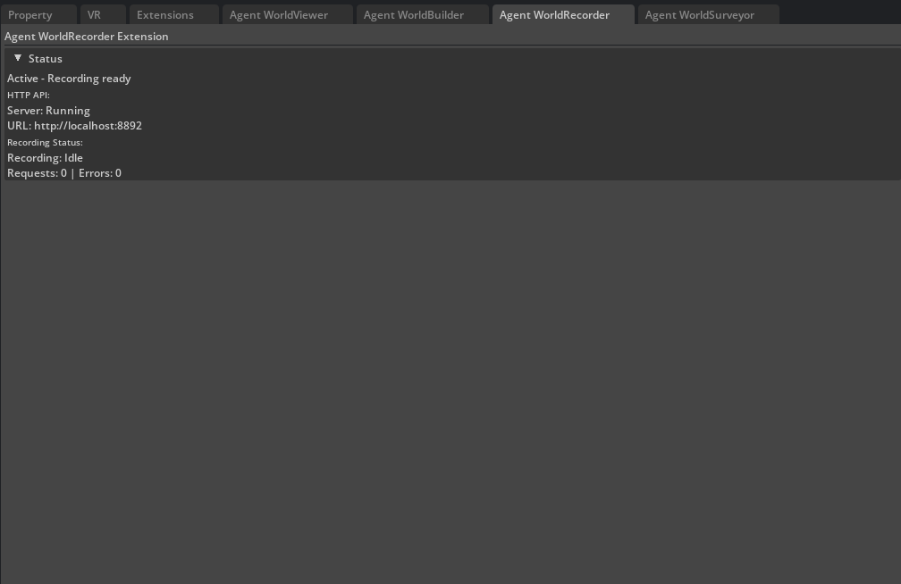

# WorldRecorder Extension

Capture screenshots and record videos from Isaac Sim viewports. WorldRecorder enables AI agents to generate visual documentation, create training datasets, and record simulations with professional quality output.


*WorldRecorder extension interface in Isaac Sim showing video recording controls and capture settings.*

## For New Users

**WorldRecorder captures screenshots and videos from Isaac Sim programmatically.** Instead of using external screen recording software, you can:

- **Ask Claude Code**: "Take a screenshot of the current scene" or "Record a 10-second video"
- **Capture specific moments**: Automatically screenshot after scene changes or camera moves
- **Document workflows**: Generate visual records of simulations and scene modifications
- **Create presentations**: Record smooth camera movements showcasing your 3D scenes

**You don't need to use the HTTP API directly** - the MCP integration handles all the technical details automatically.

## Features

### Screenshot Capture
- **Single Frame Capture**: High-quality PNG screenshots
- **Optional Depth Buffer**: Include depth information for analysis
- **Custom Resolution**: Resize output images as needed
- **Automatic Naming**: Timestamp-based filenames or custom paths

### Video Recording
- **Kit-Native Capture**: Uses omni.kit.capture.viewport for optimal performance
- **Multiple Formats**: MP4, AVI, MOV support
- **Quality Control**: Configurable FPS and duration settings
- **Duration Limits**: Automatic stop after specified time
- **Session Management**: Tracked recording sessions with unique IDs

### Output Management
- **Flexible Paths**: Custom output directories and filenames  
- **Format Detection**: Automatic format selection from file extensions
- **Size Optimization**: Configurable compression settings
- **Batch Processing**: Efficient handling of multiple captures

### Performance Features
- **Non-blocking Operation**: Capture without stopping simulation
- **Thread Safety**: Proper Isaac Sim viewport integration
- **Kit Integration**: Native omni.kit.capture.viewport usage
- **Session Tracking**: Efficient session and output management

## API Endpoints

### Screenshot Capture

**POST** `/viewport/capture_frame`
```json
{
  "output_path": "/tmp/screenshot.png",
  "width": 1920,
  "height": 1080,
  "include_depth": false
}
```

### Video Recording

**POST** `/video/start`
```json
{
  "output": "/tmp/simulation.mp4",
  "fps": 30,
  "width": 1920,
  "height": 1080,
  "codec": "h264",
  "crf": 23,
  "preset": "medium",
  "max_duration_sec": 60
}
```

**POST** `/video/stop`
```json
{
  "output": "/tmp/recording.mp4"
}
```

### Status and Control

**GET** `/video/status` - Current recording status and statistics
**GET** `/health` - Extension health and encoder availability  
**GET** `/metrics` - Performance metrics and hardware status
**GET** `/metrics.prom` - Prometheus-format metrics for monitoring systems

### Recording Aliases

The API also exposes recording aliases equivalent to `/video/*` endpoints:

**POST** `/recording/start` – start recording (alias of `/video/start`)

**POST** `/recording/stop` – stop recording (alias of `/video/stop`)

**GET** `/recording/status` – recording status (alias of `/video/status`)

### Debug and Diagnostics

Debug endpoints have been removed in the current implementation. Use `/health` and `/metrics` for troubleshooting.

## Configuration

### Basic Settings
```json
{
  "server_port": 8892,
  "debug_mode": false,
  "default_fps": 24,
  "max_recording_duration": 300
}
```

### Quality and Performance
```json
{
  "default_crf": 23,
  "recommended_max_duration": 30,
  "max_queue_size": 100,
  "hardware_encoding_preferred": true
}
```

### File Management
```json
{
  "output_directory": "/tmp/recordings",
  "auto_cleanup_recordings": false,
  "min_file_size_bytes": 500,
  "temp_file_prefix": "viewport_capture_"
}
```

### Threading and Timeouts
```json
{
  "encoder_timeout_sec": 120.0,
  "default_timeout_sec": 30.0,
  "cleanup_delay_sec": 5.0
}
```

## Usage Examples

### Basic Screenshot Capture
```python
import requests

# Capture current viewport
response = requests.post('http://localhost:8892/viewport/capture_frame', json={
    'output_path': '/tmp/current_view.png'
})

if response.json()['success']:
    print(f"Screenshot saved: {response.json()['output_path']}")
```

### High-Quality Screenshots
```python
# Capture high-resolution screenshot with depth
response = requests.post('http://localhost:8892/viewport/capture_frame', json={
    'output_path': '/tmp/hires_capture.png',
    'width': 3840,
    'height': 2160,
    'include_depth': True
})

print(f"Captured at {response.json()['resolution']}")
```

### Video Recording
```python
import time

# Start recording
start_response = requests.post('http://localhost:8892/video/start', json={
    'output': '/tmp/simulation_recording.mp4',
    'fps': 30,
    'crf': 20,  # High quality
    'preset': 'slow',  # Better compression
    'max_duration_sec': 120
})

if start_response.json()['success']:
    print("Recording started...")
    
    # Monitor recording status
    for i in range(12):  # Check for 60 seconds
        time.sleep(5)
        status = requests.get('http://localhost:8892/video/status')
        
        if status.json()['recording']:
            frames = status.json()['frames_captured']
            print(f"Recording... {frames} frames captured")
        else:
            break
    
    # Stop recording
    stop_response = requests.post('http://localhost:8892/video/stop')
    if stop_response.json()['success']:
        print(f"Recording saved: {stop_response.json()['output_path']}")
```

### Automated Scene Documentation
```python
# Document scene from multiple angles
viewpoints = [
    {'name': 'overview', 'pos': [10, 10, 10], 'target': [0, 0, 0]},
    {'name': 'closeup', 'pos': [2, 2, 2], 'target': [0, 0, 1]},
    {'name': 'side', 'pos': [15, 0, 5], 'target': [0, 0, 2]}
]

for viewpoint in viewpoints:
    # Position camera (requires WorldViewer)
    requests.post('http://localhost:8900/set_camera_position', json={
        'position': viewpoint['pos'],
        'target': viewpoint['target']
    })
    
    # Wait for camera to settle
    time.sleep(0.5)
    
    # Capture screenshot
    requests.post('http://localhost:8892/capture_frame', json={
        'output_path': f'/tmp/scene_{viewpoint["name"]}.png',
        'width': 1920,
        'height': 1080
    })
```

### Time-lapse Recording
```python
# Create time-lapse of scene changes
requests.post('http://localhost:8892/video/start', json={
    'output': '/tmp/timelapse.mp4',
    'fps': 10,  # Lower FPS for time-lapse effect
    'crf': 18,  # High quality
    'max_duration_sec': 300  # 5 minutes max
})

# Simulation or scene changes happen here...
# Recording captures all viewport changes automatically

# Stop when done
requests.post('http://localhost:8892/video/stop')
```

### Batch Screenshot Generation
```python
# Generate screenshots of all objects in scene
import requests

# Get list of all objects (requires WorldBuilder)
scene = requests.get('http://localhost:8899/get_scene')

for element in scene.json()['elements']:
    object_path = element['usd_path']
    
    # Frame the object (requires WorldViewer)
    requests.post('http://localhost:8900/frame_object', json={
        'object_path': object_path,
        'distance': 3.0
    })
    
    # Capture screenshot
    safe_name = object_path.replace('/', '_').replace(' ', '_')
    requests.post('http://localhost:8892/capture_frame', json={
        'output_path': f'/tmp/object_{safe_name}.png',
        'width': 1024,
        'height': 1024
    })
```

## Video Codecs and Quality

### Supported Codecs
- **H.264 (h264)**: Widely compatible, good compression
- **H.265 (hevc)**: Better compression, newer standard
- **VP9**: Open source, web-friendly
- **AV1**: Next-generation compression

### Quality Settings
- **CRF 18-23**: High quality (larger files)
- **CRF 24-28**: Good quality (balanced)
- **CRF 29-35**: Lower quality (smaller files)

### Encoding Presets
- **ultrafast**: Fastest encoding, larger files
- **fast/medium**: Balanced speed and size
- **slow/veryslow**: Best compression, slower encoding

## MCP Integration

WorldRecorder provides MCP tools for AI agents:

- `worldrecorder_capture_frame` - Screenshot capture
- `worldrecorder_start_recording` - Begin video recording
- `worldrecorder_stop_recording` - End recording
- `worldrecorder_get_status` - Monitor recording state
- `worldrecorder_health` - System health check
- `worldrecorder_get_metrics` - Performance metrics
- `worldrecorder_metrics_prometheus` - Prometheus metrics

## Advanced Features

### Custom Frame Processing
```python
# Capture frames at specific simulation steps
simulation_steps = [0, 100, 500, 1000, 2000]

for step in simulation_steps:
    # Advance simulation to specific step
    advance_simulation_to_step(step)  # Custom function
    
    # Capture frame
    requests.post('http://localhost:8892/capture_frame', json={
        'output_path': f'/tmp/step_{step:04d}.png'
    })
```

### Recording with Metadata
```python
# Start recording with detailed settings
recording_config = {
    'output': '/tmp/detailed_recording.mp4',
    'fps': 60,
    'width': 2560,
    'height': 1440,
    'codec': 'h264',
    'crf': 20,
    'preset': 'medium',
    'pix_fmt': 'yuv420p',  # Compatibility format
    'container': 'mp4'
}

response = requests.post('http://localhost:8892/recording/start', json=recording_config)
```

### Performance Monitoring
```python
# Monitor recording performance
status = requests.get('http://localhost:8892/video/status')
metrics = requests.get('http://localhost:8892/metrics')

print(f"Recording: {status.json()['recording']}")
print(f"Frames captured: {status.json().get('frames_captured', 0)}")
print(f"Queue size: {metrics.json().get('queue_size', 0)}")
print(f"Hardware encoding: {metrics.json().get('hardware_encoding', False)}")
```

## Error Handling

WorldRecorder provides detailed error information:

```json
{
  "success": false,
  "error": "Recording already in progress",
  "current_recording": {
    "output": "/tmp/current.mp4",
    "started_at": "2024-01-01T12:00:00Z",
    "frames_captured": 150
  }
}
```

## Performance Notes

- **Hardware Encoding**: Significantly faster than software encoding
- **Queue Management**: Larger queues handle frame bursts better
- **Resolution Impact**: Higher resolutions require more memory and processing
- **Codec Selection**: H.264 offers best compatibility vs performance

## Troubleshooting

### Common Issues

1. **No Output File**: Check write permissions and disk space
2. **Poor Quality**: Adjust CRF and preset settings
3. **Recording Stops**: Monitor for timeout or duration limits
4. **Performance Issues**: Check hardware encoder availability

### Debug Information

Use standard endpoints for troubleshooting:
- `/health` - Extension health and connectivity issues
- `/metrics` - Performance metrics and hardware status
- `/video/status` - Current recording state information
