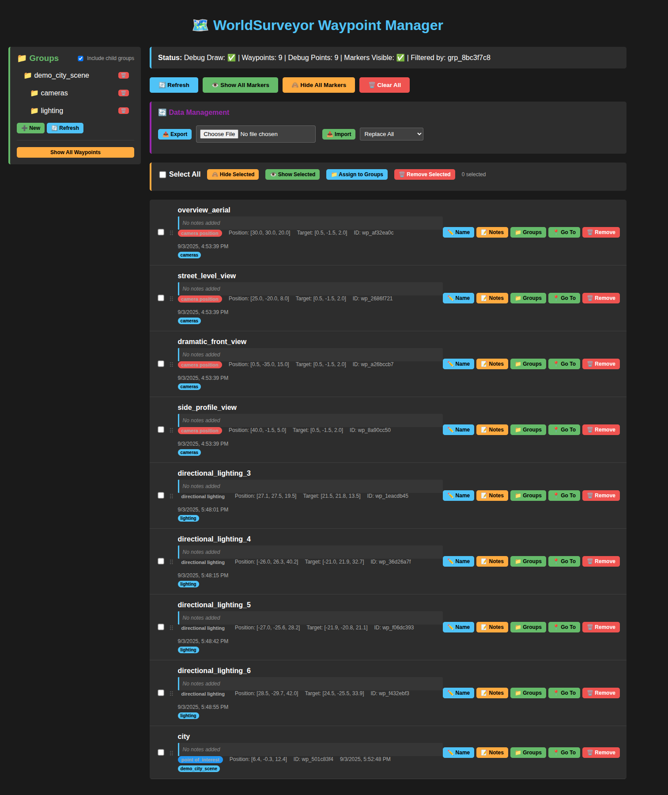
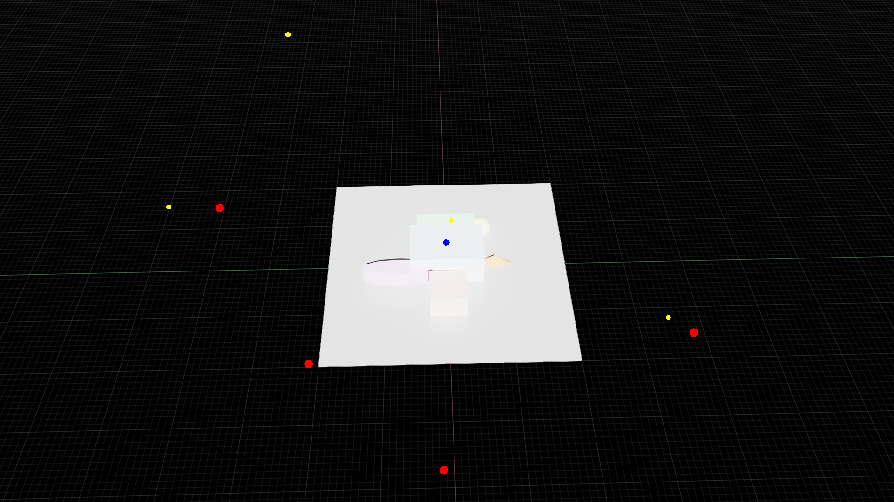
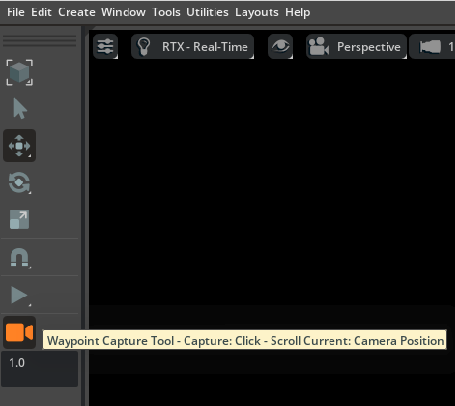
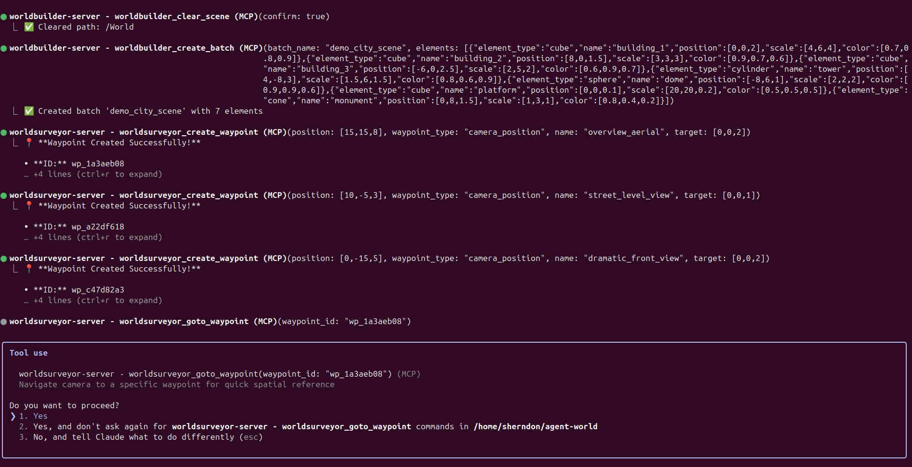

# WorldSurveyor Waypoint Manager

**Version:** 2025-09-03  
**URL:** `http://localhost:8891`  
**Extension:** `omni.agent.worldsurveyor`

## Overview

The WorldSurveyor Waypoint Manager is a comprehensive web-based interface for creating, organizing, and managing spatial waypoints in Isaac Sim. It provides sophisticated features for scene navigation, spatial planning, and AI-powered scene understanding.

## 🚀 Getting Started

### Prerequisites
- Isaac Sim running with WorldSurveyor extension enabled
- WorldSurveyor HTTP API active on port 8891
- Modern web browser

### Accessing the Manager
1. Ensure Isaac Sim is running
2. Navigate to `http://localhost:8891` in your web browser
3. The waypoint manager interface will load automatically


*The WorldSurveyor Waypoint Manager web interface showing hierarchical groups, waypoint list with bulk operations, and comprehensive filtering options.*

## 📍 Core Features

### Waypoint Management
- **Create waypoints** with position, type, and target information
- **Edit waypoint properties** including name, notes, and metadata
- **Remove individual waypoints** or use bulk operations
- **Real-time synchronization** with Isaac Sim viewport

### Waypoint Types
- **Point of Interest** - General spatial markers
- **Camera Position** - Specific viewpoints with target directions
- **Spawn Point** - Object or character spawn locations
- **Lighting Position** - Lighting setup points
- **Audio Source** - Spatial audio locations
- **Selection Mark** - Temporary markers for selection
- **Object Anchor** - Reference points for object placement
- **Directional Lighting** - Directional light setup positions

### Visual Markers
- **3D debug markers** displayed in Isaac Sim viewport
- **Toggle visibility** for all markers or individual waypoints
- **Color-coded markers** based on waypoint type
- **Automatic cleanup** when waypoints are deleted


*Waypoint markers visualized in the Isaac Sim viewport as colored debug draw points, providing spatial context for navigation and scene organization.*

## 📁 Group Organization

### Hierarchical Groups
- **Create nested group structures** for complex organization
- **Drag-and-drop organization** (coming soon)
- **Color-coded groups** with custom colors
- **Group descriptions** for documentation

### Group Operations
- **Assign waypoints to groups** individually or in bulk
- **Remove waypoints from groups** with bulk operations
- **Filter waypoints by group** with hierarchical inclusion
- **Toggle child group inclusion** in filtering

### Group Filtering
The Groups section includes an **"Include child groups"** checkbox:
- ☑️ **Checked** (default): Filtering by parent groups shows all waypoints in child groups
- ☐ **Unchecked**: Shows only waypoints directly assigned to the selected group

## 🔧 Bulk Operations

### Selection System
- **Select All checkbox** to select/deselect all visible waypoints
- **Individual checkboxes** for each waypoint
- **Selection counter** shows how many waypoints are selected
- **Persistent selection** across filtering operations

### Bulk Actions
- **🙈 Hide Selected** - Hide selected waypoints from viewport
- **👁️ Show Selected** - Show selected waypoints in viewport  
- **📁 Assign to Groups** - Add selected waypoints to one or more groups
- **🗑️ Remove Selected** - Delete multiple waypoints at once (with confirmation)

### Selection Workflows
1. Use filters to narrow down waypoints
2. Select specific waypoints or use "Select All"
3. Apply bulk operations (hide, show, group, delete)
4. Operations apply immediately with visual feedback

## 📤📥 Import & Export

### Export Functionality
- **Export all waypoints and groups** to JSON format
- **Hierarchical group structure** preserved
- **Complete metadata** including positions, targets, types
- **Timestamped exports** for version tracking

### Import Functionality
- **Import from JSON** with validation
- **Two merge modes:**
  - **Replace**: Clear all existing data and import
  - **Append**: Add imported data to existing waypoints
- **Group ID mapping** handles conflicts automatically
- **Error reporting** for failed imports
- **Real-time progress feedback**

### Export Format
```json
{
  "version": "1.0",
  "exported_at": "2025-09-03T10:10:27.103540",
  "waypoints": [
    {
      "id": "wp_c71a75ac",
      "name": "overview_aerial",
      "position": [30, 30, 20],
      "target": [0.5, -1.5, 2],
      "waypoint_type": "camera_position",
      "timestamp": "2025-09-02T14:32:08.661000",
      "metadata": {"groups": []},
      "group_ids": []
    }
  ],
  "groups": [
    {
      "id": "grp_4301f151", 
      "name": "Cube Orbit Views",
      "description": "Cardinal direction camera positions",
      "parent_group_id": null,
      "color": "#FF6B35",
      "children": []
    }
  ]
}
```

## 🎮 Navigation & Camera Control

### Waypoint Navigation
- **Click waypoint names** to navigate camera to that position
- **Automatic camera positioning** for camera_position waypoints
- **Smooth camera transitions** in Isaac Sim viewport
- **Target-aware navigation** respects waypoint target directions


*WorldSurveyor toolbar integration in Isaac Sim showing the Waypoint Capture Tool for creating waypoints at current camera positions.*

### Camera Integration
- **Real-time position capture** from Isaac Sim camera
- **Automatic target calculation** based on camera direction
- **Viewport synchronization** with waypoint markers

## ⚙️ Settings & Configuration

### Display Options
- **Marker visibility toggle** for all waypoints
- **Individual waypoint visibility** control
- **Group-based visibility** filtering
- **Real-time viewport updates**

### Data Management
- **Automatic persistence** to SQLite database
- **Thread-safe operations** for concurrent access
- **Session tracking** for import/export operations
- **Metadata preservation** across operations

## 🔍 Filtering & Search

### Filter Options
- **Group-based filtering** with hierarchical support
- **Waypoint type filtering** by type categories
- **Show All** to clear all filters
- **Active filter indicators** in the interface

### Search Capabilities
- **Name-based searching** (coming soon)
- **Metadata searching** (coming soon)
- **Position-based filtering** (coming soon)

## 🎨 User Interface

### Layout
- **Sidebar**: Groups organization and filtering
- **Main Area**: Waypoint list with bulk operations
- **Action Bar**: Import/export and global operations
- **Status Bar**: Current filter and waypoint counts

### Visual Design
- **Dark theme** optimized for Isaac Sim workflow
- **Color-coded elements** for easy identification
- **Responsive design** works on different screen sizes
- **Accessibility considerations** with keyboard navigation

### Interactive Elements
- **Hover effects** for all clickable elements
- **Confirmation dialogs** for destructive operations
- **Progress indicators** for long-running operations
- **Success/error notifications** via alerts

## 🔧 Technical Details

### API Integration
- **HTTP API** on port 8891
- **RESTful endpoints** for all operations
- **JSON request/response** format
- **Error handling** with meaningful messages

### Performance
- **Optimized queries** with indexed database access
- **Batch operations** for bulk actions
- **Minimal viewport updates** to prevent lag
- **Memory-efficient** marker management

### Thread Safety
- **Coordinated shutdown** between UI and Isaac Sim
- **Thread-safe database** operations
- **Main thread validation** for Isaac Sim API calls
- **Background processing** for non-blocking operations

## 📚 Common Workflows

### Scene Survey Workflow
1. **Load your scene** in Isaac Sim
2. **Position camera** at interesting viewpoints
3. **Create waypoints** at each position (manual or via toolbar)
4. **Organize waypoints** into logical groups
5. **Export waypoint data** for documentation or sharing

### Camera Setup Workflow  
1. **Create camera_position waypoints** at key angles
2. **Set targets** for each camera position
3. **Group cameras** by scene or purpose (e.g., "Product Views", "Cinematic Angles")
4. **Test navigation** between waypoints
5. **Export setup** for animation or rendering workflows

### Spatial Planning Workflow
1. **Create different waypoint types** (spawn, lighting, etc.)
2. **Use hierarchical groups** to organize by function
3. **Toggle visibility** to focus on specific elements
4. **Use bulk operations** to manage large waypoint sets
5. **Import/export** for collaboration or version control

### AI Scene Analysis Workflow
1. **Create comprehensive waypoint coverage** of the scene
2. **Use descriptive names and metadata** for AI context
3. **Export structured data** for AI processing
4. **Import processed waypoints** with AI-generated insights
5. **Navigate between AI-recommended viewpoints**

## 🚨 Troubleshooting

### Common Issues

**Waypoints not appearing in viewport**
- Check that markers are enabled (toggle visibility)
- Verify Isaac Sim is running and connected
- Refresh the viewport or restart Isaac Sim

**Import/Export errors**
- Verify JSON format matches expected structure
- Check file permissions for export location
- Ensure Isaac Sim is not busy with other operations

**Group filtering not working**
- Check the "Include child groups" toggle setting
- Verify group assignments are correct
- Refresh the waypoint list

**Performance issues with many waypoints**
- Use groups to organize and filter waypoints
- Hide markers when not needed
- Consider archiving old waypoints via export

### Error Messages
- **"waypoint_id is required"**: API call missing required parameter
- **"Import failed: Invalid JSON"**: Export file is corrupted or wrong format
- **"Group not found"**: Trying to assign waypoints to non-existent group
- **"Maximum waypoints reached"**: Database limit exceeded (check configuration)

## 🔄 Updates & Changelog

### Recent Updates (2025-09-03)
- ✅ Added hierarchical group filtering with toggle checkbox
- ✅ Implemented bulk "Remove Selected" functionality  
- ✅ Fixed import/export functionality for all waypoint types
- ✅ Improved error handling and user feedback
- ✅ Enhanced UI responsiveness and visual feedback

### Upcoming Features
- 🔄 Drag-and-drop waypoint organization
- 🔄 Search and filter by waypoint properties
- 🔄 Waypoint reordering within groups
- 🔄 Batch waypoint editing capabilities
- 🔄 Advanced export formats (CSV, XML)

## 🆘 Support

### Documentation
- **[Main Documentation](./README.md)** - General setup and configuration
- **[MCP Integration](./mcp-integration.md)** - API integration details
- **[Extension Documentation](./extensions/)** - Technical extension details

### Getting Help
- Check the Isaac Sim console for error messages
- Review the HTTP API logs for debugging
- Create issues in the project repository for bugs or feature requests
- Include screenshots and error messages when reporting issues

### MCP Integration Example


*Example of using WorldSurveyor through Claude Code's MCP integration, showing waypoint creation, navigation, and AI-powered spatial understanding workflows.*

---

*This documentation covers WorldSurveyor Waypoint Manager as of September 2025. Features and interface may evolve - check the latest version in your installation.*