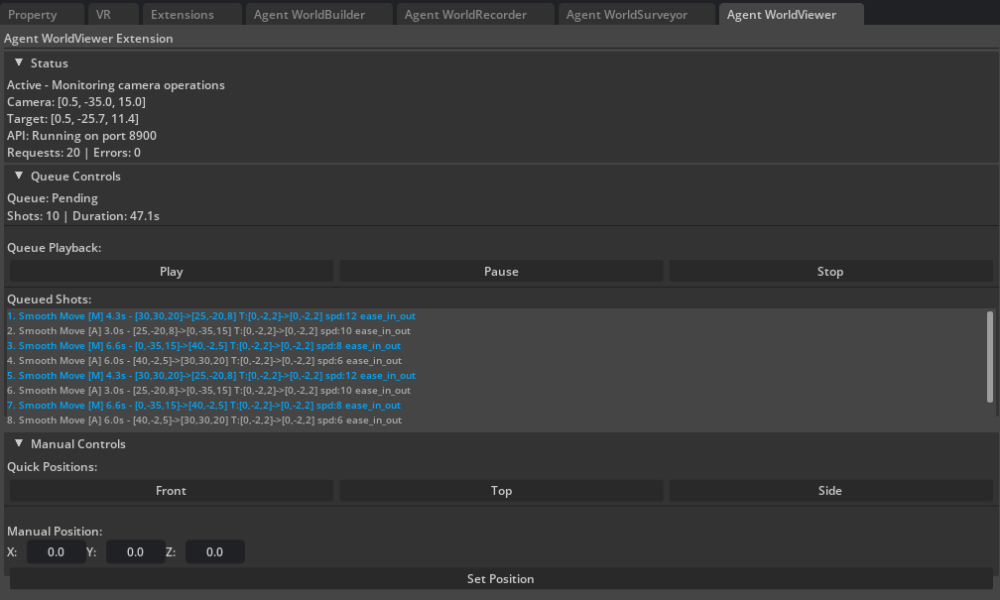

# WorldViewer Extension

Control camera positioning and create cinematic movements in Isaac Sim. WorldViewer enables AI agents to navigate 3D scenes with smooth camera transitions, orbital controls, and automated framing.


*WorldViewer extension interface in Isaac Sim showing camera control tools and cinematic movement options.*

## Features

### Camera Positioning
- **Precise Control**: Set exact camera position and target
- **Look-at Targeting**: Point camera at specific coordinates
- **Up Vector Control**: Define camera orientation
- **Bounds Checking**: Safe camera positioning within scene limits

### Cinematic Movements
- **Smooth Transitions**: Animated camera movements with easing
- **Multiple Easing Types**: Linear, ease-in-out, bounce, elastic
- **Configurable Duration**: Control movement timing
- **Movement Interruption**: Stop movements in progress

### Object Framing
- **Auto-framing**: Automatically position camera to frame objects
- **Distance Calculation**: Optimal viewing distance based on object size  
- **Multi-object Framing**: Frame multiple objects simultaneously

### Orbital Controls
- **Spherical Coordinates**: Position camera using azimuth and elevation
- **Center Point Orbiting**: Orbit around any 3D coordinate
- **Distance Control**: Maintain specific distance from center

## API Endpoints (canonical)

Note: canonical paths include the `/camera/` prefix. Backward‑compatible aliases may exist.

### Camera Control

**POST** `/camera/set_position`
```json
{
  "position": [5, 5, 5],
  "target": [0, 0, 0],
  "up_vector": [0, 0, 1]
}
```

**POST** `/camera/orbit`
```json
{
  "center": [0, 0, 1],
  "distance": 10,
  "elevation": 30,
  "azimuth": 45
}
```

### Object Framing

**POST** `/camera/frame_object`
```json
{
  "object_path": "/World/my_cube",
  "distance": 5.0
}
```

### Cinematic Movements

**POST** `/camera/smooth_move`
```json
{
  "start_position": [0, 0, 5],
  "end_position": [10, 0, 5],
  "start_target": [0, 0, 0],
  "end_target": [10, 0, 0],
  "duration": 3.0,
  "easing_type": "ease_in_out"
}
```

**POST** `/camera/stop_movement` (alias: `/movement/stop`)
```json
{
  "movement_id": "movement_12345"
}
```

### Status and Control

**GET** `/camera/status` - Current camera position and orientation
**GET** `/camera/movement_status?movement_id=...` - Check movement progress
**GET** `/health` - Extension health status  
**GET** `/metrics` - Performance metrics

## Configuration

### Basic Settings
```json
{
  "server_port": 8900,
  "debug_mode": false,
  "enable_cinematic_mode": true,
  "smooth_movement_enabled": true
}
```

### Movement Controls  
```json
{
  "default_movement_duration": 3.0,
  "max_movement_duration": 60.0,
  "camera_bounds_checking": true
}
```

### Camera Bounds
```json
{
  "camera_min_bounds": [-50, -50, -10],
  "camera_max_bounds": [50, 50, 20],
  "min_target_distance": 0.1,
  "max_target_distance": 100.0
}
```

## Usage Examples

### Basic Camera Positioning
```python
import requests

# Position camera to look at origin
requests.post('http://localhost:8900/camera/set_position', json={
    'position': [10, 10, 10],
    'target': [0, 0, 0]
})

# Get current camera status
status = requests.get('http://localhost:8900/get_camera_status')
print(f"Camera at: {status.json()['position']}")
```

### Orbital Camera Movement
```python
# Orbit around an object at different angles
for angle in [0, 90, 180, 270]:
    requests.post('http://localhost:8900/camera/orbit', json={
        'center': [0, 0, 1],
        'distance': 8,
        'elevation': 20,
        'azimuth': angle
    })
    
    # Take screenshot at each position
    requests.post('http://localhost:8892/capture_frame', 
                  json={'output_path': f'/tmp/view_{angle}.png'})
```

### Cinematic Movements
```python
# Create smooth camera movement
movement = requests.post('http://localhost:8900/camera/smooth_move', json={
    'start_position': [0, -10, 5],
    'end_position': [0, 10, 5],
    'start_target': [0, 0, 0],
    'end_target': [0, 0, 0],
    'duration': 5.0,
    'easing_type': 'ease_in_out'
})

movement_id = movement.json()['movement_id']

# Monitor movement progress
import time
while True:
status = requests.get('http://localhost:8900/camera/movement_status', params={'movement_id': movement_id})
    if status.json()['completed']:
        break
    print(f"Progress: {status.json()['progress']}%")
    time.sleep(0.5)
```

### Object Framing
```python
# Automatically frame different objects
objects = ['/World/cube1', '/World/sphere1', '/World/cylinder1']

for obj in objects:
    # Frame the object
    requests.post('http://localhost:8900/camera/frame_object', json={
        'object_path': obj,
        'distance': 3.0
    })
    
    # Capture the framed view
    requests.post('http://localhost:8892/capture_frame',
                  json={'output_path': f'/tmp/{obj.split("/")[-1]}.png'})
```

## Easing Types

WorldViewer supports multiple easing functions for smooth movements:

- **linear**: Constant speed movement
- **ease_in**: Slow start, fast finish  
- **ease_out**: Fast start, slow finish
- **ease_in_out**: Slow start and finish, fast middle
- **bounce**: Bouncing effect at the end
- **elastic**: Elastic spring effect

## MCP Integration

WorldViewer provides MCP tools for AI agents:

- `worldviewer_set_camera_position` - Direct camera positioning
- `worldviewer_orbit_camera` - Orbital positioning  
- `worldviewer_frame_object` - Automatic object framing
- `worldviewer_smooth_move` - Cinematic movements
- `worldviewer_get_camera_status` - Status monitoring

## Advanced Features

### Camera Path Recording
```python
# Record a series of camera positions
positions = []
for i in range(0, 360, 30):
    pos = requests.post('http://localhost:8900/camera/orbit', json={
        'center': [0, 0, 1],
        'distance': 5,
        'elevation': 0, 
        'azimuth': i
    })
    positions.append(pos.json()['position'])

# Use positions for smooth interpolated movement
```

### Multi-object Framing
```python
# Get transforms of multiple objects
objects = ['/World/obj1', '/World/obj2', '/World/obj3']
transforms = []

for obj in objects:
    # Get object transform (requires WorldBuilder API)
    transform = requests.get(f'http://localhost:8899/get_asset_transform', 
                           json={'usd_path': obj})
    transforms.append(transform.json())

# Calculate center point and frame all objects
center = calculate_center(transforms)  # Custom function
requests.post('http://localhost:8900/camera/set_position', json={
    'position': [center[0] + 10, center[1] + 10, center[2] + 5],
    'target': center
})
```

## Error Handling

WorldViewer provides detailed error responses:

```json
{
  "success": false,
  "error": "Camera position out of bounds",
  "bounds": {
    "min": [-50, -50, -10],
    "max": [50, 50, 20]
  },
  "requested": [100, 0, 0]
}
```

## Performance Notes

- **Smooth Movements**: Limited to one active movement at a time
- **Bounds Checking**: Validation prevents invalid camera positions
- **Thread Safety**: Camera operations are properly synchronized with Isaac Sim
- **Real-time Updates**: Camera changes immediately update the viewport

## Troubleshooting

### Common Issues

1. **Camera Not Moving**: Check if another movement is in progress
2. **Out of Bounds**: Verify camera position is within configured bounds
3. **Object Not Found**: Ensure object exists in scene before framing
4. **Jerky Movement**: Use appropriate easing types for smooth motion

### Debug Mode

Enable debug logging with `debug_mode: true` for detailed movement tracking and camera state information.
